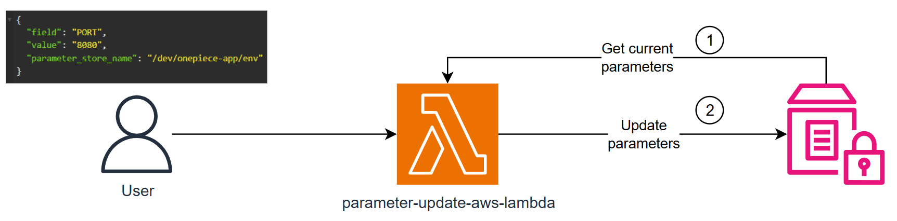

# Parameters Updater AWS Lambda Function

This is a simple AWS Lambda function that updates the parameters in the AWS Systems Manager Parameter Store.



## How to use

1. Clone the repository
2. Install the dependencies
3. Create a new Lambda function in the AWS Console
4. Upload the zip file to the Lambda function

## Dependencies

- [boto3](https://pypi.org/project/boto3/)
- SSM (AWS Systems Manager)
    - Parameter Store
- pytest
- moto

## Getting Started

Build the project with the following command:

``` bash
sam build --use-container
```

Run locally with the following command:

``` bash
sam local start-api --docker-network local_localstack_network --region us-east-1
```

Request example:

``` bash
curl --request POST \
  --url http://127.0.0.1:3000/update-parameter \
  --header 'Content-Type: application/json' \
  --header 'User-Agent: insomnia/9.3.2' \
  --data '{
	"field": "TOGGLE_CARDS_OFFLINE",
	"value": "1000",
    "parameter_store_name": "/dev/onepiece-app/env"
}'
```

Response Success Status Code: 200

``` json
{
	"message": "Parameters updated successfully",
	"parameters": "PORT=8080;TIMEOUT_API_REQUEST=1000;TOGGLE_CARDS_OFFLINE=123"
}
``` 

---
Developed by [Jean Jacques Barros](https://github.com/jjeanjacques10)

